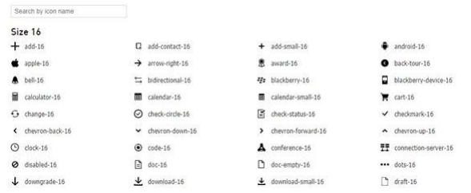
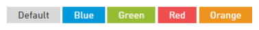

# Intermedia: тестовое задание

## Требования к решению
* [x] Создать приложение на Angular.
* [x] Импортировать приложенный файл [`basic-icons.ts`][icons] со списком и HTML-содержимым иконок.
* [ ] Реализовать список иконок.  

    * [ ] Список должен быть сгруппирован по размеру на основании атрибута `width`.
    * [ ] В группе иконки должны быть отсортированы по названию.
    * [ ] Иконки располагаются в столбцах, по порядку слева направо, сверху вниз.
    * [ ] При изменении размеров экрана, количество столбцов должно быть адаптивно.
    Рекомендуется реализовывать на `flex` или `grid`.
* [ ] Реализовать поиск по названию иконки
(фильтровать элементы списка при вводе в строку поиска).
* [ ] Реализовать раскрашивание иконок в списке  

    * [ ] При клике на кнопку с названием цвета иконки должны перекраситься в выбранный цвет.
* [ ] Реализовать компонент accordion.  

    * [ ] В открытом состоянии виден контент, который вложен в аккордеон.
    * [ ] Иконка раскрытого и закрытого состояния должна быть из тех,
    что предложены в файле [`basic-icons.ts`][icons].
    * [ ] Перекрашивание иконок в списке не должно влиять на иконку в компоненте.
* [ ] Обернуть каждую группу иконок в этот компонент.

[Источник][source].

[icons]: assets/basic-icons.ts
[source]: https://docviewer.yandex.ru/view/926995654/htmlimage?id=rqn-5necd11smxz7wcdnrt77rph1vwjtnnv43gx9v7t8dh8w8em7mor1r7g49b36i04lygtronpl0zyahjqn06xrc8fsmkjd8jiq8fy&width=794&height=1124&name=bg-0.png&dsid=31370251099b4a1ad984708c8507e222
